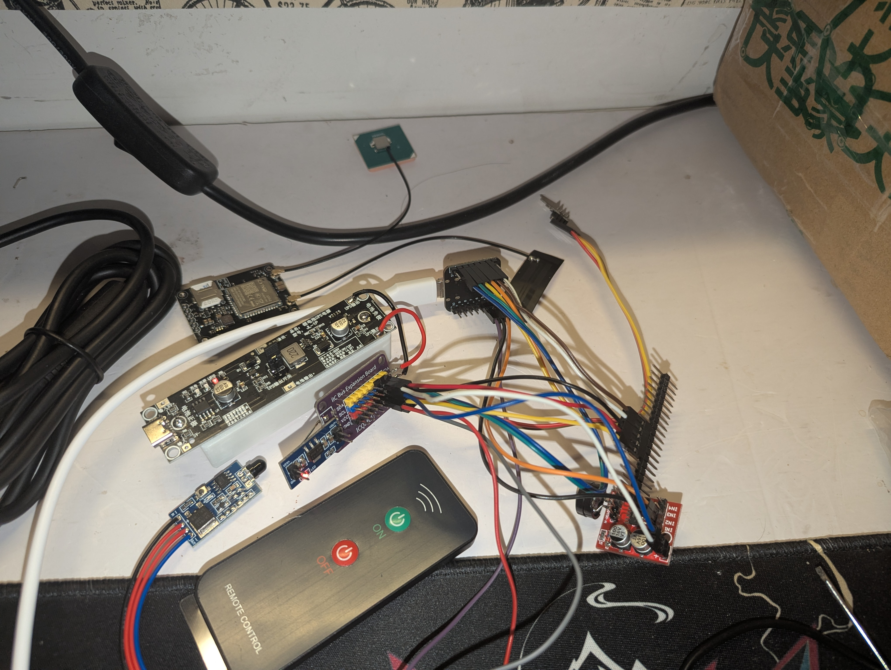

# mqtt-micropython
24G 雷达检测人体并上报 OneNET(MQTT) ，玩具类型项目，主要为快速测试用

虽然本项目为开源项目，使用时 __请务必将鉴权信息替换成对应项目的信息__

使用内容：

|模块|型号|
|-----|-----|
|毫米波雷达|HLK-LD2402|
|4G模块|DX-CT511|
|蓝牙模块|ECB02H2|
|红外遥控模块|NEC编码遥控|
|声音提示模块|无源蜂鸣器|
|隔离模块|TB6612|
|电压转换芯片|AMS1117-3.3V|
|主控芯片|ESP32-WROOM-DEV|
|UPS模块|18650锂电池模块|
|串口调试模块|CH340G|
|数字逻辑分析仪|nanoDLA|

使用到的算法:

|内容|算法|
|-----|-----|
|OneNET token 计算方法|hmac_sha256、hmac_md5、base64|
|对称加密算法|AES-256、base64|

为其他改进提供一个模板便于后续使用 MicroPython 进行开发
